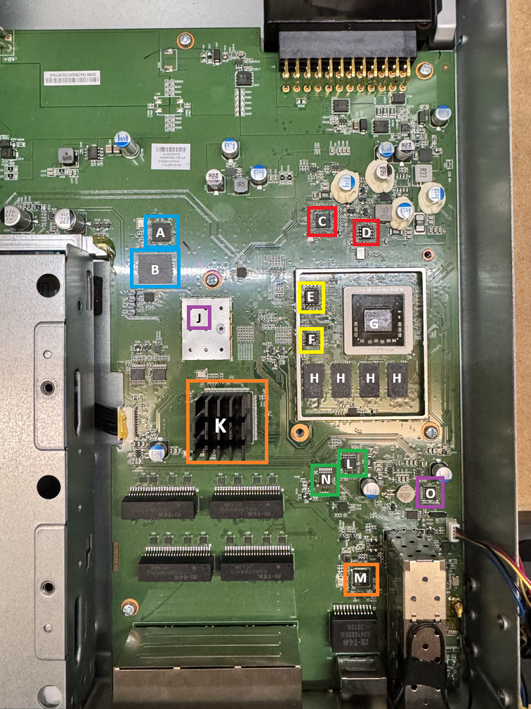

# UDM-Pro Dream Machine Pro

## Chip Description
| ID  | Description  | ID  | Description  |
|:---:|-------------:|:---:| ------------:|
| A   | GL3224E USB3.0 eMMC Controller         | G   | TBA         |
| B   | 16GB eMMC Flash         | H   | 4GB DDR (4x 512MB DDR RAM)         |
| C   | ASM1042A PCIe USB3.0 Controller         | J   | TBA         |
| D   | W25X05CL ASM1042A USB3.0 Firmware         | K   | Network Switch         |
| E   | MX25U6435F 8MB SPI FLASH | L   | TBA         |
| F   | AT24C64D 64KB EEPROM I2C Address 0x57         | N   | TBA         |
| M   | Annapurna Labs AL324 Cortex A57         | O   | TBA         |

