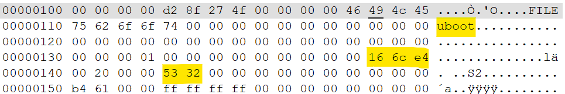

# Extract Firmware

## Extracting Recovery firmware from a working UDM-Pro
If you have the luxuary of a working UDMPro you can connect over SSH and configure a TFTP server to receive the firmware dump.

replace "192.168.214.120" with your local PC IP address with a [TFTP Server](http://tftpd32.jounin.net) running as Administrator.

```
dd if=/dev/disk/by-partlabel/recovery of=/volume1/recovery.bin
tftp -l /volume1/recovery.bin -r recovery.bin -p 192.168.214.120
rm /volume1/recovery.bin
```
## Extracting uBoot from a downloaded UDM-Pro firmware

Download a [UDMPro firmware](https://ui.com/download/software/udm-pro) 

Use a hex editor to find the uBoot offset and length.
1. Find the text "uboot"
2. Record the length in hex (6 digits)
3. Find the uboot offset start

4. Convertboth Hex numbers to Dec
5. uBoot Length hex=16 6c e4 [converted](https://www.rapidtables.com/convert/number/hex-to-decimal.html?x=166CE4) to decimal is 1469668
6. uBoot offset hex=144 [converted](https://www.rapidtables.com/convert/number/hex-to-decimal.html?x=144) to decimal is 324

Linux
```
dd if=9a40-UDMPRO-4.2.12.bin of=uboot-4.2.12.bin bs=1 skip=324 count=1469668 conv=notrunc
```

Windows Powershell
```
$filePath = "C:\Path\To\9a40-UDMPRO-4.2.12.bin"
$offset = 324
$bytesToExtract = 1469668
$outputPath = "C:\Path\To\uboot-4.1.12.bin"

try {
    $fileBytes = [System.IO.File]::ReadAllBytes($filePath)
    $extractedBytes = $fileBytes | Select-Object -Skip $offset -First $bytesToExtract

    [System.IO.File]::WriteAllBytes($outputPath, $extractedBytes)

    Write-Host "Successfully extracted $bytesToExtract bytes from offset $offset to $outputPath"
} catch {
    Write-Error "Error extracting file: $($_.Exception.Message)"
}
```