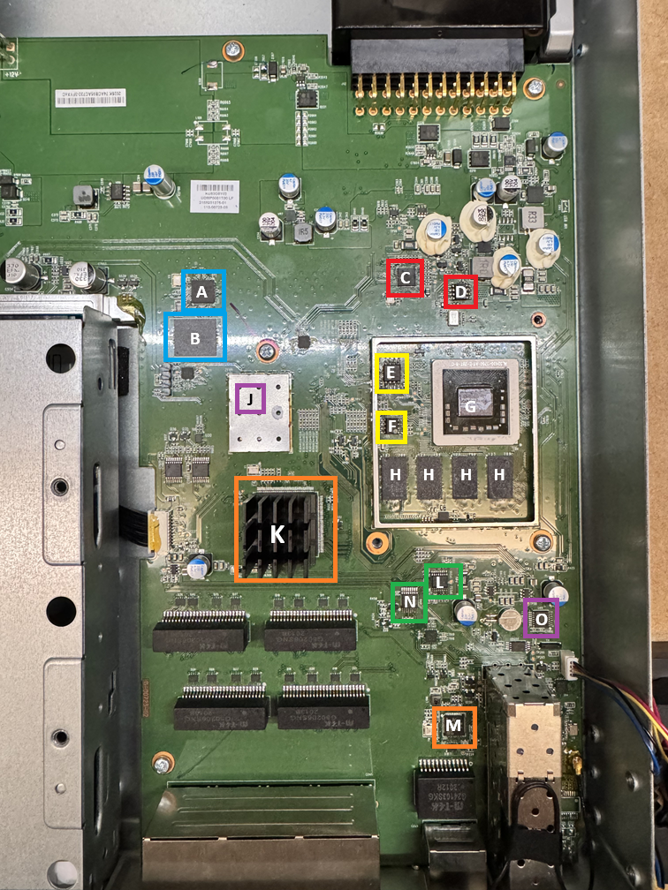

# UDM-Pro Dream Machine Pro

## Circuit Layout

The SOC is connected to the main eMMC storage via a USB3 controller.

AL324_SOC --PCIe--> ASM1042A --USB3--> GL3224E --> eMMC

## Board Layout
| ID  | Description  | ID  | Description  |
|:---:|-------------:|:---:| ------------:|
| A   | GL3224E USB3.0 eMMC Controller         | G   | Annapurna Labs AL324 Cortex A57         |
| B   | THGBMFG7C1LBAIL 16GB eMMC Flash         | H   | 4GB DDR (4x 512MB DDR RAM)         |
| C   | ASM1042A PCIe USB3.0 Controller         | J   | LMK00338 PCIe Level Translator |
| D   | W25X05CL ASM1042A USB3.0 Firmware         | K   | Network Switch         |
| E   | MX25U6435F 8MB SPI FLASH | L   | ADT7470 Temperature, Sensor and Fans |
| F   | AT24C64D 64KB EEPROM I2C Address 0x57         | N   | TCA9546A I2C Expander |
| M   | AR8033-AL1A WAN 1G Ethernet | O   | TXB0104 Voltage-Level Translator |

