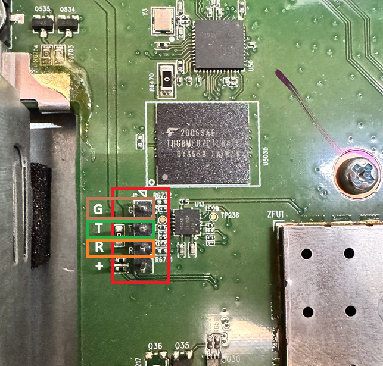

# UDMPro console cable connector

Using the three pins connect using 115200 baud

| PIN | UDMPro     | USB RS232 |
| --- | ---------- | --------- |
| G   | Ground Pin | Ground    |
| T   | TX Pin     | TX Pin    |
| R   | RX Pin     | RX Pin    |
| +   | PWR        | UNUSED    |

